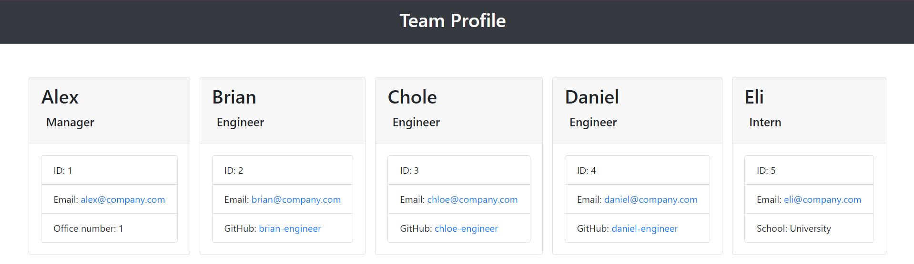

# Team Profile Generator


## Description
This repo contains a node.js CLI utilizing inquirer to create a team chart in any organization.


## Table of Contents
- [Description](#description)
- [Installation](#installation)
- [Usage](#usage)
- [License](#license)
- [Contributing](#contributing)
- [Tests](#tests)
- [Questions](#questions)

## Installation
1. Download/clone this repository [Team Profile Generator](https://github.com/melissa-tan/team-profile-generator)
	```
	git clone https://github.com/melissa-tan/team-profile-generator.git
	```
2. Make sure you have node installed on your desktop [Install Node](https://nodejs.org/en/download/)
3. Install dependencies
	```
	npm i
	```

## Usage
1. Run index.js
	``` 
	node index.js
	```
2. Select the role and answer the questions as prompted <br>
	Please click on thumbnail to view video. </br>
	[](http://www.youtube.com/watch?v=ceroChotyZE)
	

3. Once the task is finished, a success or failure message will display on the terminal.

4. my-team-profile.html will be generated under the dist folder. 


## Contribution
#### Contributors
[melissa-tan](https://github.com/melissa-tan)


## Tests
1. Run jest test
	
	```
	npm run test
	```

## Questions
If you have any questions or see any issues, please feel free to reach out!

Find me on github! [melissa-tan](https://github.com/melissa-tan) <br>
Email me at: melissatan9683@gmail.com
